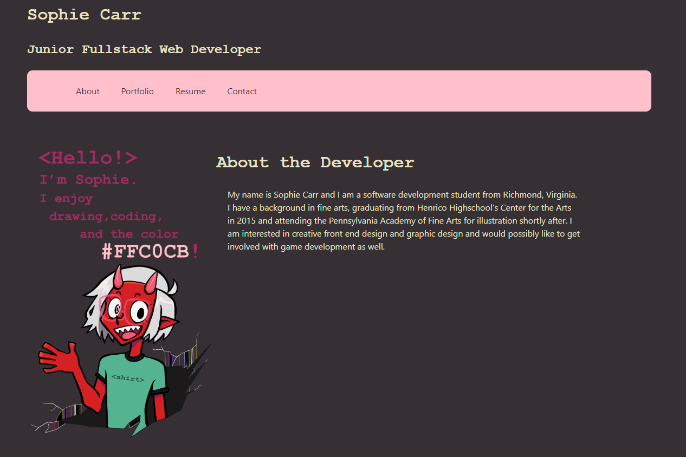

  # Challenge 20: React Portfolio

  ## Table of Contents
  - [Description](#description)
  - [Screenshot](#screenshot)
  - [Link to Deployed Site](#link)
  - [Contact](#contact)

  ## Description
  
 This project is my personal professional software development portfolio built with React.js. It demonstrates everything I've learned as a software dev so far and I've had a blast personalizing it. I'd love for you to check it out!

  ## Screenshot

  

  ## Tech Used
  
  
  
  
  
  

  ## Link

  https://pinkywiththebrain.github.io/smcarr-portfolio/

  ## Contact
  If you have any further questions:

  Read through the documentation on <a href=github.com/pinkywiththebrain>my github</a>

  Or contact me directly at sophiemc99@gmail.com